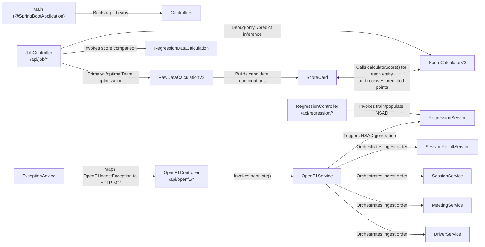
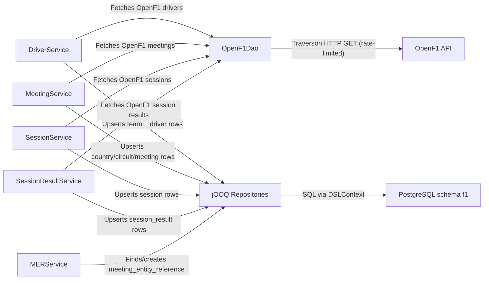
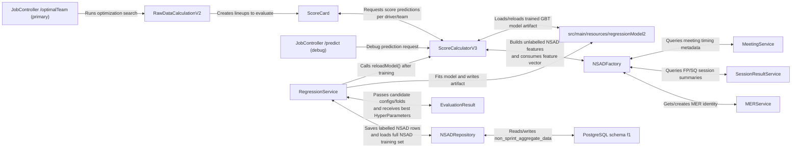

# F1-Point-Calc Architecture

## 1. System Overview

`F1-Point-Calc` is a Spring Boot service that combines:

1. **Operational APIs** for fantasy team optimization (primary), with a debug prediction endpoint.
2. **Data-ingest APIs** that pull race data from OpenF1 and persist it to Postgres.
3. **ML training/inference APIs** built on Apache Spark for NSAD-based regression.

The service is invoked via HTTP controllers under `/api/job`, `/api/openf1`, and `/api/regression`, and runs as a single JVM process with local Spark execution (`local[*]`).

## 2. Repository and Runtime Context

- **Repository**: `AelinaXY/F1-Point-Calc` ([GitHub](https://github.com/AelinaXY/F1-Point-Calc))
- **Language/runtime**: Java 21 + Spring Boot 3.5.6 ([`pom.xml`](pom.xml))
- **Persistence**: PostgreSQL via jOOQ `DSLContext` ([`DatabaseConfiguration`](src/main/java/org/f1/config/DatabaseConfiguration.java))
- **Schema lifecycle**: Flyway migrations + jOOQ codegen during `generate-sources` ([`pom.xml`](pom.xml), [`src/main/resources/migration`](src/main/resources/migration))
- **External integration**: OpenF1 HTTP API via Traverson + Resilience4j rate limiting ([`TraversonConfig`](src/main/java/org/f1/config/TraversonConfig.java), [`OpenF1Dao`](src/main/java/org/f1/dao/OpenF1Dao.java))
- **ML runtime**: Spark Core + Spark MLlib, Spring-managed `JavaSparkContext` and `SparkSession` ([`SparkConfig`](src/main/java/org/f1/config/SparkConfig.java))
- **Configuration**: OpenF1 base URL and DB credentials in [`application.properties`](src/main/resources/application.properties)

## 3. High-Level Component Map

### 3.1 API entrypoints and orchestration

### 3.2 OpenF1 ingest and persistence boundaries

### 3.3 ML feature generation, training, and inference

## 4. Execution Flows

### 4.1 OpenF1 ingest flow

1. `OpenF1Controller` endpoints call ingest services, or `OpenF1Service.populate()` for full ingest ([`OpenF1Controller`](src/main/java/org/f1/controller/OpenF1Controller.java), [`OpenF1Service`](src/main/java/org/f1/service/OpenF1Service.java)).
2. Services fetch raw payloads through `OpenF1Dao`.
3. `OpenF1Dao` uses Traverson client, parses JSON arrays via mapper classes, throws `OpenF1IngestException` on failure ([`OpenF1Dao`](src/main/java/org/f1/dao/OpenF1Dao.java)).
4. Services persist to Postgres through jOOQ repositories (`saveMeeting`, `saveDriver`, `saveSession`, `saveSessionResult`).
5. Exception path is normalized to HTTP 502 by `ExceptionAdvice` ([`ExceptionAdvice`](src/main/java/org/f1/exception/ExceptionAdvice.java)).

### 4.2 Team optimization flow (primary) + debug prediction path

1. `JobController` loads static driver/team datasets from CSV.
2. `/optimalTeam` is the main endpoint: it configures `RawDataCalculationV2`, computes candidate `ScoreCard`s, and returns ranked alternatives.
3. During that optimization path, `ScoreCard` repeatedly calls `ScoreCalculatorInterface.calculateScore(...)` (using `ScoreCalculatorV3` in runtime wiring), so ML inference is in the hot path of the primary endpoint.
4. `/predict` is a debug endpoint that directly exposes per-entity `ScoreCalculatorV3` outputs and `CostCalculator` deltas.

### 4.3 NSAD generation and training flow

1. `/api/regression/nsad` calls `RegressionService.populateNSADRegressionData()`.
2. For each year/entity/meeting, `NSADFactory` builds features and labels:
   - resolves `MeetingEntityReference` via `MERService`/`MERRepository`,
   - queries session summaries from `SessionResultService`,
   - computes historical/derived features.
3. `NSADRepository.saveNSAD` upserts rows keyed by `MEETING_ENTITY_REFERENCE`.
4. `/api/regression/trainNSAD`:
   - loads all NSAD rows,
   - runs `EvaluationResult.parallelGridSearch(...)` for hyperparameter selection,
   - trains best `GBTRegressionModel`,
   - persists model under `src/main/resources/regressionModel2`,
   - reloads live inference model via `ScoreCalculatorV3.reloadModel()`.

## 5. Data and State

### 5.1 Persistent state

- Core ingest tables: `country`, `circuit`, `meeting`, `team`, `driver`, `session`, `session_result`, `meeting_entity_reference` ([migrations](src/main/resources/migration)).
- ML feature table: `non_sprint_aggregate_data` (NSAD).
- Repositories perform upsert-style writes with jOOQ (`onConflict ... doUpdate` / `doNothing`).

### 5.2 In-memory/runtime state

- Spark context/session are singleton Spring beans.
- `ScoreCalculatorV3` holds an in-memory `GBTRegressionModel` instance and reloads after training.
- `RawDataCalculationV2` uses a static synchronized set `validTeamSet` as temporary search state.
- Spring caching enabled globally; score calculators use `@Cacheable`.

### 5.3 Filesystem artifacts

- Input datasets: multiple CSV files in `src/main/resources`.
- Model artifacts: versioned model folders plus active `regressionModel2`.
- Training log file: hard-coded to repository-local `machineLearning.log` in `EvaluationResult`.

## 6. Tooling and Extension Points

### 6.1 Build/tool chain integration

- Flyway and jOOQ are wired to Maven `generate-sources`; schema changes are expected via migration files first, then regenerated code.

### 6.2 Scoring strategy extension

- `ScoreCalculatorInterface` is the main strategy boundary:
  - `ScoreCalculator` (heuristic weighted model),
  - `ScoreCalculatorV3` (Spark GBT inference),
  - `ActualScoreCalculator` (ground-truth lookup).
- `ScoreCard`, `RawDataCalculationV2`, and `RegressionDataCalculation` consume this interface, enabling substitution without changing core orchestration.

### 6.3 Integration and HTTP client extension

- `TraversonConfig` centralizes HTTP client behavior (pooling, timeouts, rate limiter), making OpenF1 client behavior extensible via Spring bean composition.

### 6.4 Domain extension candidates

- `agents` package (`BaseAgent`, `CostCapMultAgent`) provides domain objects for strategy-like modeling but is not currently wired into controller/service runtime paths.

## 7. Risks and Constraints

### Observed constraints

- Spark is configured for local execution with substantial memory/off-heap settings; runtime profile is tuned for local-heavy processing rather than distributed cluster execution ([`SparkConfig`](src/main/java/org/f1/config/SparkConfig.java)).
- Several important paths rely on repository-local files/paths (`regressionModel2`, `machineLearning.log`), coupling runtime behavior to filesystem layout.
- Controller-level static CSV loading (`JobController`) means entity baselines are process-start state, not DB-driven.
- OpenF1 ingest is rate-limited to 2 requests/second; failures surface as gateway-style errors.

### Observed quality/operational caveats

- `EvaluationResult.getFolds(...)` currently shuffles meeting IDs but iterates map entries when assigning train/test; the effective split path should be reviewed for intended behavior.
- `RawDataCalculationV2.validTeamSet` is static and shared; concurrent requests could contend on global calculation state.

### Explicit absences in current code

- No queue/event-bus/scheduler-driven processing was found (`@Scheduled`, Kafka/Rabbit/JMS annotations not present in `src/main/java`).

## 8. References

### Entrypoint and API boundaries

- [`src/main/java/org/f1/Main.java`](src/main/java/org/f1/Main.java)
- [`src/main/java/org/f1/controller/JobController.java`](src/main/java/org/f1/controller/JobController.java)
- [`src/main/java/org/f1/controller/OpenF1Controller.java`](src/main/java/org/f1/controller/OpenF1Controller.java)
- [`src/main/java/org/f1/controller/RegressionController.java`](src/main/java/org/f1/controller/RegressionController.java)
- [`src/main/java/org/f1/exception/ExceptionAdvice.java`](src/main/java/org/f1/exception/ExceptionAdvice.java)

### Service orchestration

- [`src/main/java/org/f1/service/OpenF1Service.java`](src/main/java/org/f1/service/OpenF1Service.java)
- [`src/main/java/org/f1/service/RegressionService.java`](src/main/java/org/f1/service/RegressionService.java)
- [`src/main/java/org/f1/service/NSADFactory.java`](src/main/java/org/f1/service/NSADFactory.java)
- [`src/main/java/org/f1/service/MERService.java`](src/main/java/org/f1/service/MERService.java)
- [`src/main/java/org/f1/service/DriverService.java`](src/main/java/org/f1/service/DriverService.java)
- [`src/main/java/org/f1/service/MeetingService.java`](src/main/java/org/f1/service/MeetingService.java)
- [`src/main/java/org/f1/service/SessionService.java`](src/main/java/org/f1/service/SessionService.java)
- [`src/main/java/org/f1/service/SessionResultService.java`](src/main/java/org/f1/service/SessionResultService.java)

### Calculation and ML

- [`src/main/java/org/f1/calculations/RawDataCalculationV2.java`](src/main/java/org/f1/calculations/RawDataCalculationV2.java)
- [`src/main/java/org/f1/calculations/ScoreCalculator.java`](src/main/java/org/f1/calculations/ScoreCalculator.java)
- [`src/main/java/org/f1/calculations/ScoreCalculatorV3.java`](src/main/java/org/f1/calculations/ScoreCalculatorV3.java)
- [`src/main/java/org/f1/calculations/RegressionDataCalculation.java`](src/main/java/org/f1/calculations/RegressionDataCalculation.java)
- [`src/main/java/org/f1/calculations/ScoreCalculatorInterface.java`](src/main/java/org/f1/calculations/ScoreCalculatorInterface.java)
- [`src/main/java/org/f1/regression/EvaluationResult.java`](src/main/java/org/f1/regression/EvaluationResult.java)
- [`src/main/java/org/f1/domain/NSAD.java`](src/main/java/org/f1/domain/NSAD.java)
- [`src/main/java/org/f1/domain/ScoreCard.java`](src/main/java/org/f1/domain/ScoreCard.java)

### Data access, config, and schema

- [`src/main/java/org/f1/dao/OpenF1Dao.java`](src/main/java/org/f1/dao/OpenF1Dao.java)
- [`src/main/java/org/f1/config/TraversonConfig.java`](src/main/java/org/f1/config/TraversonConfig.java)
- [`src/main/java/org/f1/config/DatabaseConfiguration.java`](src/main/java/org/f1/config/DatabaseConfiguration.java)
- [`src/main/java/org/f1/config/SparkConfig.java`](src/main/java/org/f1/config/SparkConfig.java)
- [`src/main/java/org/f1/repository/NSADRepository.java`](src/main/java/org/f1/repository/NSADRepository.java)
- [`src/main/java/org/f1/repository/MERRepository.java`](src/main/java/org/f1/repository/MERRepository.java)
- [`src/main/java/org/f1/repository/DriverRepository.java`](src/main/java/org/f1/repository/DriverRepository.java)
- [`src/main/java/org/f1/repository/MeetingRepository.java`](src/main/java/org/f1/repository/MeetingRepository.java)
- [`src/main/java/org/f1/repository/SessionRepository.java`](src/main/java/org/f1/repository/SessionRepository.java)
- [`src/main/java/org/f1/repository/SessionResultRepository.java`](src/main/java/org/f1/repository/SessionResultRepository.java)
- [`src/main/resources/application.properties`](src/main/resources/application.properties)
- [`src/main/resources/migration`](src/main/resources/migration)
- [`pom.xml`](pom.xml)
